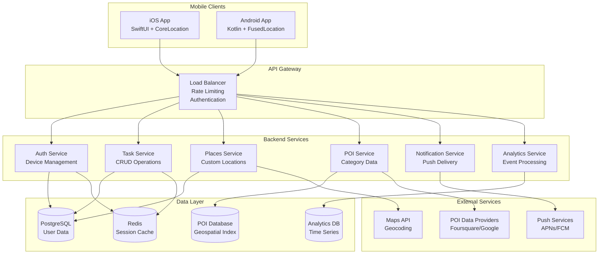

# Design Document

## Overview

Near Me is architected as a mobile-first application with a client-server architecture optimized for location-based services. The system prioritizes on-device processing for privacy and battery efficiency while leveraging cloud services for POI data, user synchronization, and analytics. The design emphasizes a calm, luxury user experience with intelligent notification management and robust offline capabilities.

## Architecture

### High-Level System Architecture



### Mobile Client Architecture

#### iOS Implementation
- **Framework**: SwiftUI for UI, CoreLocation for geofencing
- **Location Strategy**: Significant-change monitoring + visit detection for battery efficiency
- **Geofence Management**: Maximum 20 active geofences, rolling priority system
- **Background Processing**: Background App Refresh for geofence re-registration
- **Local Storage**: Core Data for offline task/place storage

#### Android Implementation  
- **Framework**: Kotlin + Jetpack Compose for UI, FusedLocationProvider + GeofencingClient
- **Location Strategy**: Balanced power accuracy with adaptive sampling
- **Background Processing**: WorkManager for reliable background tasks
- **Geofence Management**: GeofencingClient with PendingIntent receivers
- **Local Storage**: Room database for offline functionality

## Components and Interfaces

### 1. Authentication & User Management

#### Device-Based Authentication
```typescript
interface AuthService {
  createDeviceAccount(): Promise<DeviceAccount>
  associateEmail(email: string): Promise<void>
  refreshToken(): Promise<AuthToken>
  validateSession(): Promise<boolean>
}

interface DeviceAccount {
  id: string
  deviceId: string
  email?: string
  createdAt: Date
  preferences: UserPreferences
}
```

#### User Preferences
```typescript
interface UserPreferences {
  quietHours: TimeRange
  defaultRadii: GeofenceRadii
  notificationStyle: 'minimal' | 'standard' | 'detailed'
  premiumStatus: 'free' | 'trial' | 'premium'
  privacyMode: 'standard' | 'foreground_only'
}
```

### 2. Task Management System

#### Task Entity
```typescript
interface Task {
  id: string
  userId: string
  title: string
  description?: string
  location: TaskLocation
  status: 'active' | 'completed' | 'muted'
  createdAt: Date
  completedAt?: Date
  geofences: Geofence[]
}

interface TaskLocation {
  type: 'custom_place' | 'poi_category'
  placeId?: string
  category?: POICategory
  customRadii?: GeofenceRadii
}
```

#### Task Service Interface
```typescript
interface TaskService {
  createTask(task: CreateTaskRequest): Promise<Task>
  updateTask(id: string, updates: Partial<Task>): Promise<Task>
  deleteTask(id: string): Promise<void>
  getUserTasks(userId: string): Promise<Task[]>
  completeTask(id: string): Promise<void>
  muteTask(id: string, duration?: number): Promise<void>
}
```

### 3. Location & Geofencing System

#### Geofence Management
```typescript
interface GeofenceManager {
  registerGeofences(task: Task): Promise<void>
  unregisterGeofences(taskId: string): Promise<void>
  updateGeofences(task: Task): Promise<void>
  handleGeofenceEvent(event: GeofenceEvent): Promise<void>
  optimizeActiveGeofences(): Promise<void>
}

interface Geofence {
  id: string
  taskId: string
  latitude: number
  longitude: number
  radius: number
  type: 'approach_5mi' | 'approach_3mi' | 'approach_1mi' | 'arrival' | 'post_arrival'
  isActive: boolean
}

interface GeofenceEvent {
  geofenceId: string
  eventType: 'enter' | 'exit'
  timestamp: Date
  location: Coordinate
  confidence: number
}
```

#### POI Integration
```typescript
interface POIService {
  findNearbyPOIs(location: Coordinate, category: POICategory, radius: number): Promise<POI[]>
  getPOIDetails(id: string): Promise<POI>
  updatePOIData(): Promise<void>
  validatePOIAccuracy(poi: POI, userFeedback: POIFeedback): Promise<void>
}

interface POI {
  id: string
  name: string
  category: POICategory
  location: Coordinate
  address: string
  verified: boolean
  lastUpdated: Date
}

type POICategory = 'gas' | 'pharmacy' | 'grocery' | 'bank' | 'post_office'
```

### 4. Notification System

#### Notification Manager
```typescript
interface NotificationManager {
  scheduleNotification(notification: LocationNotification): Promise<void>
  cancelNotification(notificationId: string): Promise<void>
  handleNotificationAction(action: NotificationAction): Promise<void>
  respectQuietHours(notification: LocationNotification): boolean
  bundleNotifications(notifications: LocationNotification[]): LocationNotification
}

interface LocationNotification {
  id: string
  taskId: string
  type: 'approach' | 'arrival' | 'post_arrival'
  title: string
  body: string
  actions: NotificationAction[]
  scheduledTime: Date
  bundled?: boolean
}

interface NotificationAction {
  id: string
  title: string
  type: 'complete' | 'snooze_15m' | 'snooze_1h' | 'snooze_today' | 'open_map' | 'mute'
}
```

### 5. Places Management

#### Custom Places
```typescript
interface PlaceService {
  createPlace(place: CreatePlaceRequest): Promise<Place>
  updatePlace(id: string, updates: Partial<Place>): Promise<Place>
  deletePlace(id: string): Promise<void>
  getUserPlaces(userId: string): Promise<Place[]>
  geocodeAddress(address: string): Promise<Coordinate>
}

interface Place {
  id: string
  userId: string
  name: string
  location: Coordinate
  address?: string
  type: 'home' | 'work' | 'custom'
  defaultRadii: GeofenceRadii
  createdAt: Date
}

interface GeofenceRadii {
  approach: number // miles
  arrival: number // meters
  postArrival: boolean
}
```

## Data Models

### Database Schema

#### Users Table
```sql
CREATE TABLE users (
    id UUID PRIMARY KEY DEFAULT gen_random_uuid(),
    device_id TEXT UNIQUE NOT NULL,
    email TEXT,
    preferences JSONB DEFAULT '{}',
    premium_status TEXT DEFAULT 'free',
    created_at TIMESTAMPTZ DEFAULT NOW(),
    updated_at TIMESTAMPTZ DEFAULT NOW()
);
```

#### Tasks Table
```sql
CREATE TABLE tasks (
    id UUID PRIMARY KEY DEFAULT gen_random_uuid(),
    user_id UUID REFERENCES users(id) ON DELETE CASCADE,
    title TEXT NOT NULL,
    description TEXT,
    location_type TEXT NOT NULL, -- 'custom_place' | 'poi_category'
    place_id UUID REFERENCES places(id),
    poi_category TEXT,
    custom_radii JSONB,
    status TEXT DEFAULT 'active',
    created_at TIMESTAMPTZ DEFAULT NOW(),
    completed_at TIMESTAMPTZ,
    INDEX idx_user_tasks (user_id, status),
    INDEX idx_active_tasks (status) WHERE status = 'active'
);
```

#### Places Table
```sql
CREATE TABLE places (
    id UUID PRIMARY KEY DEFAULT gen_random_uuid(),
    user_id UUID REFERENCES users(id) ON DELETE CASCADE,
    name TEXT NOT NULL,
    latitude DECIMAL(10, 8) NOT NULL,
    longitude DECIMAL(11, 8) NOT NULL,
    address TEXT,
    place_type TEXT NOT NULL,
    default_radii JSONB NOT NULL,
    created_at TIMESTAMPTZ DEFAULT NOW(),
    INDEX idx_user_places (user_id),
    INDEX idx_location (latitude, longitude)
);
```

#### Geofences Table
```sql
CREATE TABLE geofences (
    id UUID PRIMARY KEY DEFAULT gen_random_uuid(),
    task_id UUID REFERENCES tasks(id) ON DELETE CASCADE,
    latitude DECIMAL(10, 8) NOT NULL,
    longitude DECIMAL(11, 8) NOT NULL,
    radius INTEGER NOT NULL, -- meters
    geofence_type TEXT NOT NULL,
    is_active BOOLEAN DEFAULT true,
    created_at TIMESTAMPTZ DEFAULT NOW(),
    INDEX idx_task_geofences (task_id),
    INDEX idx_active_geofences (is_active) WHERE is_active = true
);
```

#### Events Table (Analytics)
```sql
CREATE TABLE events (
    id UUID PRIMARY KEY DEFAULT gen_random_uuid(),
    user_id UUID REFERENCES users(id),
    event_type TEXT NOT NULL,
    event_data JSONB,
    session_id TEXT,
    timestamp TIMESTAMPTZ DEFAULT NOW(),
    INDEX idx_events_user_time (user_id, timestamp),
    INDEX idx_events_type_time (event_type, timestamp)
);
```

### POI Data Model
```sql
CREATE TABLE pois (
    id UUID PRIMARY KEY DEFAULT gen_random_uuid(),
    external_id TEXT UNIQUE,
    name TEXT NOT NULL,
    category TEXT NOT NULL,
    latitude DECIMAL(10, 8) NOT NULL,
    longitude DECIMAL(11, 8) NOT NULL,
    address TEXT,
    verified BOOLEAN DEFAULT false,
    source TEXT NOT NULL,
    last_updated TIMESTAMPTZ DEFAULT NOW(),
    INDEX idx_poi_location (latitude, longitude),
    INDEX idx_poi_category (category),
    INDEX idx_poi_verified (verified)
);
```

## Error Handling

### Client-Side Error Handling

#### Location Services Errors
- **Permission Denied**: Graceful degradation with educational prompts
- **Location Unavailable**: Fallback to last known location with user notification
- **Geofence Limit Exceeded**: Intelligent prioritization of active geofences

#### Network Errors
- **Offline Mode**: Queue operations locally with sync on reconnection
- **API Failures**: Exponential backoff with circuit breaker pattern
- **Timeout Handling**: Progressive timeout increases with user feedback

#### Data Consistency
- **Sync Conflicts**: Last-write-wins with user notification for critical changes
- **Cache Invalidation**: TTL-based cache with manual refresh options
- **Storage Limits**: Automatic cleanup of old completed tasks and events

### Server-Side Error Handling

#### API Error Responses
```typescript
interface APIError {
  code: string
  message: string
  details?: any
  timestamp: Date
  requestId: string
}

// Standard error codes
const ErrorCodes = {
  INVALID_REQUEST: 'INVALID_REQUEST',
  UNAUTHORIZED: 'UNAUTHORIZED', 
  RATE_LIMITED: 'RATE_LIMITED',
  GEOFENCE_LIMIT: 'GEOFENCE_LIMIT',
  POI_UNAVAILABLE: 'POI_UNAVAILABLE',
  INTERNAL_ERROR: 'INTERNAL_ERROR'
}
```

#### Resilience Patterns
- **Circuit Breaker**: Prevent cascade failures to external POI services
- **Bulkhead**: Isolate critical services (auth, notifications) from analytics
- **Timeout**: Aggressive timeouts for external API calls
- **Retry**: Exponential backoff for transient failures

## Testing Strategy

### Unit Testing
- **Coverage Target**: 90% for core business logic
- **Focus Areas**: Geofence calculations, notification logic, task state management
- **Mocking**: External services (POI providers, push notifications, location services)

### Integration Testing
- **API Testing**: Full request/response cycle testing for all endpoints
- **Database Testing**: Transaction integrity and constraint validation
- **Location Simulation**: Synthetic location events for geofence testing

### End-to-End Testing
- **User Flows**: Complete onboarding → task creation → notification → completion
- **Platform Testing**: iOS 16-18, Android 10-15 across device matrix
- **Performance Testing**: Battery usage, memory consumption, notification latency

### Specialized Testing
- **Location Testing**: Route replay simulation, dense POI corridors, edge cases
- **Notification Testing**: Do Not Disturb respect, bundling logic, action handling
- **Offline Testing**: Network interruption scenarios, sync recovery
- **Privacy Testing**: Data minimization validation, encryption verification

### Testing Tools & Infrastructure
- **Mobile**: XCTest (iOS), Espresso (Android), Detox for E2E
- **Backend**: Jest/Vitest for unit tests, Supertest for API testing
- **Location**: Custom location simulation framework
- **Performance**: Xcode Instruments, Android Profiler, custom battery monitoring

This design provides a robust foundation for implementing the Near Me application with proper separation of concerns, scalability considerations, and comprehensive error handling while maintaining the privacy-first and battery-efficient principles outlined in the requirements.